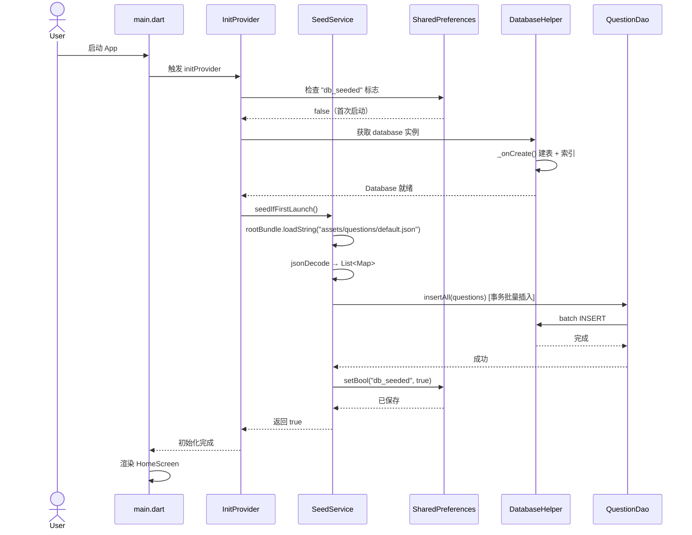
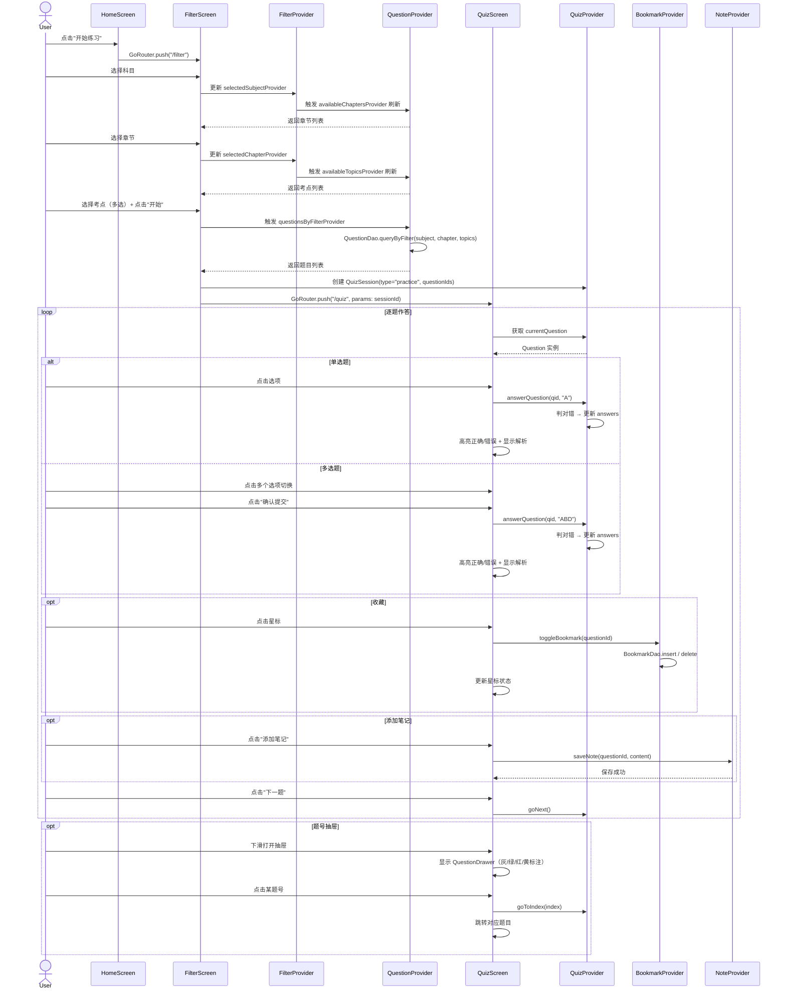
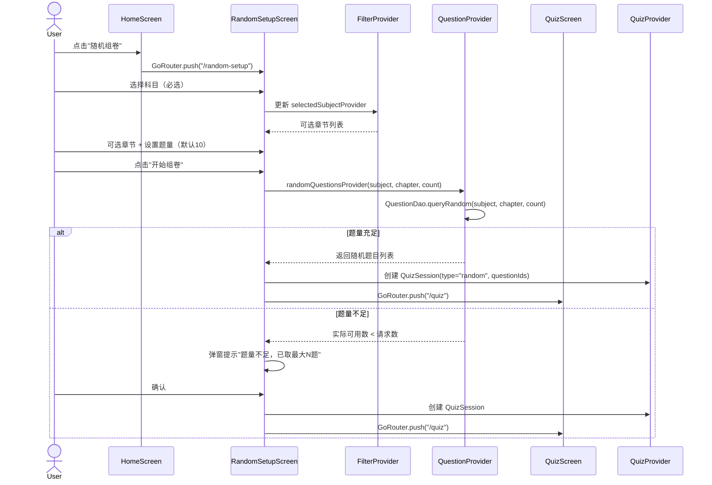
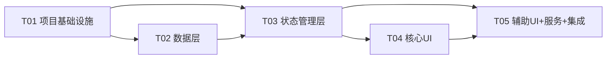

# 医考刷题 — 系统架构设计文档

> 版本：v1.0 | 日期：2025-07-12 | 架构师：高见远（Gao）

---

## 1. 实现方案 + 框架选型

### 1.1 项目结构：Layer-First

选择 **Layer-First**（按技术层分层）组织代码，理由如下：

| 考量 | Layer-First 优势 |
|------|------------------|
| 本 App 功能模块间有大量交叉引用（答题页依赖收藏/笔记/筛选状态） | 共享数据层和状态层更自然 |
| 团队中工程师按层分工更清晰 | DAO → Provider → Screen 职责分明 |
| Flutter 社区主流实践 | 生态文档、示例丰富 |

目录结构概览：

```
lib/
├── main.dart                     # 入口：ProviderScope + App 初始化
├── app.dart                      # MaterialApp + GoRouter 配置
├── core/                         # 基础设施层
│   ├── theme.dart                # 主题配置
│   ├── constants.dart            # 全局常量（色值、DB版本、路由名）
│   ├── routes.dart               # GoRouter 路由定义
│   └── database_helper.dart      # SQLite 初始化 + 版本迁移
├── models/                       # 数据模型层
│   ├── question.dart
│   ├── bookmark.dart
│   ├── note.dart
│   └── quiz_session.dart
├── dao/                          # 数据访问层
│   ├── question_dao.dart
│   ├── bookmark_dao.dart
│   ├── note_dao.dart
│   └── quiz_session_dao.dart
├── providers/                    # 状态管理层（Riverpod）
│   ├── database_provider.dart
│   ├── init_provider.dart
│   ├── question_provider.dart
│   ├── bookmark_provider.dart
│   ├── note_provider.dart
│   ├── quiz_provider.dart
│   └── filter_provider.dart
├── screens/                      # 页面层
│   ├── home_screen.dart
│   ├── filter_screen.dart
│   ├── quiz_screen.dart
│   ├── bookmark_list_screen.dart
│   ├── note_list_screen.dart
│   ├── note_edit_screen.dart
│   ├── random_setup_screen.dart
│   └── settings_screen.dart
├── widgets/                      # 可复用组件层
│   ├── question_card.dart
│   ├── option_item.dart
│   ├── question_drawer.dart
│   ├── bookmark_star.dart
│   ├── filter_chip_group.dart
│   └── group_list_view.dart
└── services/                     # 业务服务层
    ├── seed_service.dart
    ├── import_service.dart
    └── clear_data_service.dart
```

### 1.2 状态管理：flutter_riverpod

**选型理由**：

| 维度 | Riverpod 优势 |
|------|---------------|
| 复杂状态依赖 | 答题页同时依赖题目列表 + 答题状态 + 收藏状态 + 笔记状态，Riverpod 的 Provider 组合天然支持 |
| 异步数据 | 数据库操作均为异步，`AsyncValue` + `when()` 模式优雅处理 loading/error/data |
| 参数化查询 | `family` 修饰符支持按科目/章节参数化查询题目，无需手动管理参数 |
| 可测试性 | Provider 不依赖 Widget 树，单元测试时可直接 override |
| 自动回收 | `autoDispose` 防止页面退出后状态泄漏 |

**Provider 设计原则**：
- 每个 DAO 对应一个 Repository Provider（封装数据库操作 + 状态转换）
- 使用 `@riverpod` code generation 减少样板代码
- AsyncNotifierProvider 管理所有数据库异步操作
- 使用 `ref.watch` 构建响应式依赖链

### 1.3 数据库：sqflite

**选型理由**：

| 维度 | sqflite 优势 |
|------|-------------|
| 简洁性 | 直接 SQL，学习曲线低，调试直观 |
| 轻量 | 本 App 查询场景简单（三级筛选 + CRUD），无需 ORM 开销 |
| 无代码生成 | 减少构建依赖，对"零门槛"理念友好 |
| 社区成熟 | Flutter SQLite 生态中使用最广，问题易排查 |
| 性能 | 1万题量级下，正确索引后查询 < 10ms，远超 200ms 目标 |

**数据库设计要点**：
- 单数据库文件 `medical_quiz.db`，初始版本号 `1`
- 复合索引：`(subject, chapter, topic)` 加速三级筛选
- 预置题库 JSON 放置于 `assets/questions/` 目录，首次启动通过 `rootBundle` 读取后批量 INSERT
- 使用事务（Transaction）批量导入，确保原子性

### 1.4 路由：go_router

**选型理由**：

| 维度 | GoRouter 优势 |
|------|--------------|
| 声明式路由 | 路由表集中定义，一目了然 |
| 重定向 | 首次启动初始化检查，未完成时重定向到加载页 |
| 嵌套路由 | 答题页内嵌题号抽屉，使用 ShellRoute 管理 |
| 类型安全 | 路径参数 + 查询参数强类型访问 |
| 深链接 | 为未来扩展（如从笔记跳转到题目）预留能力 |

**路由表**：

| 路由路径 | 页面 | 说明 |
|----------|------|------|
| `/` | HomeScreen | 首页 |
| `/filter` | FilterScreen | 三级筛选 |
| `/quiz` | QuizScreen | 答题页（接收 session 参数） |
| `/random-setup` | RandomSetupScreen | 随机组卷设置 |
| `/bookmarks` | BookmarkListScreen | 收藏夹 |
| `/notes` | NoteListScreen | 笔记本 |
| `/notes/edit` | NoteEditScreen | 笔记编辑（接收 questionId） |
| `/settings` | SettingsScreen | 设置 |

---

## 2. 文件列表及相对路径

### 2.1 核心入口（2 文件）

| 相对路径 | 职责 |
|----------|------|
| `lib/main.dart` | App 入口，初始化 ProviderScope + 确保数据库就绪 |
| `lib/app.dart` | MaterialApp 配置，GoRouter 绑定，主题应用 |

### 2.2 基础设施层 — core/（4 文件）

| 相对路径 | 职责 |
|----------|------|
| `lib/core/theme.dart` | 主题定义（主色 #2196F3，卡片样式，字体配置） |
| `lib/core/constants.dart` | 全局常量（DB名称/版本、色值、路由名、JSON路径） |
| `lib/core/routes.dart` | GoRouter 路由表定义 |
| `lib/core/database_helper.dart` | SQLite 打开/建表/索引/迁移管理 |

### 2.3 数据模型层 — models/（4 文件）

| 相对路径 | 职责 |
|----------|------|
| `lib/models/question.dart` | Question 模型 + fromMap/toMap |
| `lib/models/bookmark.dart` | Bookmark 模型 + fromMap/toMap |
| `lib/models/note.dart` | Note 模型 + fromMap/toMap |
| `lib/models/quiz_session.dart` | QuizSession 模型 + fromMap/toMap + answers JSON 序列化 |

### 2.4 数据访问层 — dao/（4 文件）

| 相对路径 | 职责 |
|----------|------|
| `lib/dao/question_dao.dart` | 题目 CRUD + 三级筛选查询 + 随机抽取 |
| `lib/dao/bookmark_dao.dart` | 收藏 CRUD + 按科目/章节分组查询 |
| `lib/dao/note_dao.dart` | 笔记 CRUD + 按科目/章节分组查询 |
| `lib/dao/quiz_session_dao.dart` | 答题会话 CRUD + 进度保存/恢复 |

### 2.5 状态管理层 — providers/（7 文件）

| 相对路径 | 职责 |
|----------|------|
| `lib/providers/database_provider.dart` | Database 实例 Provider（单例） |
| `lib/providers/init_provider.dart` | 首次启动初始化 Provider（检查+导入预置题库） |
| `lib/providers/question_provider.dart` | 题目列表 Provider（筛选/随机/详情） |
| `lib/providers/bookmark_provider.dart` | 收藏状态 Provider（增删查/切换） |
| `lib/providers/note_provider.dart` | 笔记 Provider（增删改查） |
| `lib/providers/quiz_provider.dart` | 答题会话 Provider（答题/判分/进度） |
| `lib/providers/filter_provider.dart` | 筛选条件 Provider（科目/章节/考点选择状态） |

### 2.6 页面层 — screens/（8 文件）

| 相对路径 | 职责 |
|----------|------|
| `lib/screens/home_screen.dart` | 首页：5 个入口卡片（练习/组卷/收藏/笔记/设置） |
| `lib/screens/filter_screen.dart` | 三级筛选页：科目→章节→考点多选 |
| `lib/screens/quiz_screen.dart` | 答题页：单选/多选交互 + 解析 + 抽屉 + 星标 + 笔记入口 |
| `lib/screens/bookmark_list_screen.dart` | 收藏夹列表：按科目→章节分组展示 |
| `lib/screens/note_list_screen.dart` | 笔记本列表：按科目→章节分组展示 |
| `lib/screens/note_edit_screen.dart` | 笔记编辑页：纯文本输入 + 保存 |
| `lib/screens/random_setup_screen.dart` | 随机组卷设置：科目/章节/题量 |
| `lib/screens/settings_screen.dart` | 设置页：导入JSON + 清除数据 + 关于 |

### 2.7 可复用组件层 — widgets/（6 文件）

| 相对路径 | 职责 |
|----------|------|
| `lib/widgets/question_card.dart` | 题目卡片：题干 + 选项列表容器 |
| `lib/widgets/option_item.dart` | 选项条目：支持单选点击/多选切换 + 正确/错误高亮 |
| `lib/widgets/question_drawer.dart` | 题号抽屉：下滑展示，灰/绿/红/黄四色标注 |
| `lib/widgets/bookmark_star.dart` | 收藏星标按钮：实心/空心切换动画 |
| `lib/widgets/filter_chip_group.dart` | 多选 Chip 组：考点多选筛选 |
| `lib/widgets/group_list_view.dart` | 分组列表视图：科目→章节两级展开/折叠 |

### 2.8 业务服务层 — services/（3 文件）

| 相对路径 | 职责 |
|----------|------|
| `lib/services/seed_service.dart` | 首次启动：读取 assets JSON → 批量导入 SQLite |
| `lib/services/import_service.dart` | JSON 导入：文件选择 → 解析 → 合并/替换 → 统计反馈 |
| `lib/services/clear_data_service.dart` | 数据清除：删库重建 + 重置 SharedPreferences 标志 |

### 2.9 资源文件（3 文件）

| 相对路径 | 职责 |
|----------|------|
| `assets/questions/default.json` | 预置题库 JSON |
| `pubspec.yaml` | 依赖声明 + 资源声明 |
| `test/` | 测试目录（占位） |

**文件总数**：38 个（含资源文件），其中 `.dart` 源文件 **32** 个。

---

## 3. 数据结构和接口（类图）

```mermaid
classDiagram
    direction TB

    %% ===== Models =====
    class Question {
        +int id
        +String type
        +String subject
        +String chapter
        +String? topic
        +String stem
        +String optionsJson
        +String answer
        +String? analysis
        +List~String~ get options
        +fromMap(Map m) Question
        +toMap() Map
    }

    class Bookmark {
        +int? id
        +int questionId
        +String createdAt
        +fromMap(Map m) Bookmark
        +toMap() Map
    }

    class Note {
        +int? id
        +int questionId
        +String content
        +String updatedAt
        +fromMap(Map m) Note
        +toMap() Map
    }

    class QuizSession {
        +int? id
        +String type
        +List~int~ questionIds
        +int currentIndex
        +Map~int,String~ answers
        +String createdAt
        +fromMap(Map m) QuizSession
        +toMap() Map
    }

    %% ===== Database =====
    class DatabaseHelper {
        -static DatabaseHelper _instance
        -Database? _db
        +static const DB_NAME
        +static const DB_VERSION
        +getInstance() DatabaseHelper
        +database Future~Database~
        +_onCreate(Database db, int version)
        +_onUpgrade(Database db, int oldV, int newV)
    }

    %% ===== DAOs =====
    class QuestionDao {
        -Database _db
        +queryAll() Future~List~Question~~
        +queryByFilter(subject, chapter, topics) Future~List~Question~~
        +queryRandom(subject, chapter, count) Future~List~Question~~
        +queryById(int id) Future~Question?~
        +insertAll(List~Question~ questions) Future~void~
        +upsertAll(List~Question~ questions) Future~int~
        +count() Future~int~
    }

    class BookmarkDao {
        -Database _db
        +queryAll() Future~List~Bookmark~~
        +queryByQuestionId(int qid) Future~Bookmark?~
        +queryGrouped() Future~List~GroupedBookmark~~
        +insert(int questionId) Future~void~
        +delete(int questionId) Future~void~
        +isBookmarked(int questionId) Future~bool~
    }

    class NoteDao {
        -Database _db
        +queryAll() Future~List~Note~~
        +queryByQuestionId(int qid) Future~Note?~
        +queryGrouped() Future~List~GroupedNote~~
        +insert(int questionId, String content) Future~void~
        +update(int id, String content) Future~void~
        +delete(int id) Future~void~
    }

    class QuizSessionDao {
        -Database _db
        +insert(QuizSession session) Future~int~
        +update(QuizSession session) Future~void~
        +queryById(int id) Future~QuizSession?~
        +delete(int id) Future~void~
    }

    %% ===== Providers =====
    class DatabaseProvider {
        +databaseProvider Provider~Database~
    }

    class InitProvider {
        +initProvider FutureProvider~void~
        +isInitializedProvider StateProvider~bool~
    }

    class QuestionProvider {
        +questionsByFilterProvider FutureProvider~List~Question~~
        +randomQuestionsProvider FutureProvider~List~Question~~
        +questionDetailProvider Family FutureProvider~Question?~
    }

    class BookmarkProvider {
        +bookmarksProvider FutureProvider~List~Bookmark~~
        +isBookmarkedProvider Family FutureProvider~bool~~
        +toggleBookmark FutureProvider~void~
        +groupedBookmarksProvider FutureProvider~List~
    }

    class NoteProvider {
        +notesProvider FutureProvider~List~Note~~
        +noteByQuestionProvider Family FutureProvider~Note?~~
        +saveNoteProvider FutureProvider~void~
        +deleteNoteProvider FutureProvider~void~
        +groupedNotesProvider FutureProvider~List~
    }

    class QuizProvider {
        +currentSessionProvider StateNotifierProvider
        +answerQuestion(int qid, String answer) void
        +goNext() void
        +goToIndex(int index) void
        +currentQuestionProvider Provider~Question?~
        +sessionProgressProvider Provider~SessionProgress~
    }

    class FilterProvider {
        +selectedSubjectProvider StateProvider~String?~
        +selectedChapterProvider StateProvider~String?~
        +selectedTopicsProvider StateProvider~Set~String~~
        +availableSubjectsProvider FutureProvider~List~String~~
        +availableChaptersProvider FutureProvider~List~String~~
        +availableTopicsProvider FutureProvider~List~String~~
    }

    %% ===== Screens =====
    class HomeScreen {
        +build(BuildContext context) Widget
    }
    class FilterScreen {
        +build(BuildContext context) Widget
    }
    class QuizScreen {
        +build(BuildContext context) Widget
    }
    class BookmarkListScreen {
        +build(BuildContext context) Widget
    }
    class NoteListScreen {
        +build(BuildContext context) Widget
    }
    class NoteEditScreen {
        +build(BuildContext context) Widget
    }
    class RandomSetupScreen {
        +build(BuildContext context) Widget
    }
    class SettingsScreen {
        +build(BuildContext context) Widget
    }

    %% ===== Widgets =====
    class QuestionCard {
        +Question question
        +VoidCallback? onOptionTap
        +build(BuildContext context) Widget
    }
    class OptionItem {
        +String label
        +String text
        +bool selected
        +bool? correct
        +VoidCallback? onTap
        +bool isMultiSelect
        +build(BuildContext context) Widget
    }
    class QuestionDrawer {
        +int totalCount
        +int currentIndex
        +Map~int,DrawerItemState~ states
        +ValueChanged~int~ onItemTap
        +build(BuildContext context) Widget
    }
    class BookmarkStar {
        +bool isBookmarked
        +ValueChanged~bool~ onChanged
        +build(BuildContext context) Widget
    }
    class FilterChipGroup {
        +List~String~ options
        +Set~String~ selected
        +ValueChanged~Set~String~~ onChanged
        +build(BuildContext context) Widget
    }
    class GroupListView {
        +List~Group~ groups
        +ItemBuilder itemBuilder
        +build(BuildContext context) Widget
    }

    %% ===== Services =====
    class SeedService {
        -QuestionDao _questionDao
        -SharedPreferences _prefs
        +seedIfFirstLaunch() Future~bool~
    }
    class ImportService {
        -QuestionDao _questionDao
        +importFromFile(String path, ImportMode mode) Future~ImportResult~
    }
    class ClearDataService {
        -DatabaseHelper _dbHelper
        -SharedPreferences _prefs
        +clearAll() Future~void~
    }

    %% ===== Relationships =====
    DatabaseHelper --> QuestionDao : provides Database
    DatabaseHelper --> BookmarkDao : provides Database
    DatabaseHelper --> NoteDao : provides Database
    DatabaseHelper --> QuizSessionDao : provides Database
    QuestionDao --> Question : returns
    BookmarkDao --> Bookmark : returns
    NoteDao --> Note : returns
    QuizSessionDao --> QuizSession : returns
    Bookmark --> Question : questionId FK
    Note --> Question : questionId FK
    QuizSession --> Question : questionIds ref

    DatabaseProvider --> DatabaseHelper : creates
    InitProvider --> SeedService : calls
    QuestionProvider --> QuestionDao : uses
    BookmarkProvider --> BookmarkDao : uses
    NoteProvider --> NoteDao : uses
    QuizProvider --> QuizSessionDao : uses
    QuizProvider --> QuestionDao : uses
    FilterProvider --> QuestionDao : uses

    QuizScreen --> QuestionCard : contains
    QuizScreen --> QuestionDrawer : contains
    QuizScreen --> BookmarkStar : contains
    QuestionCard --> OptionItem : contains
    FilterScreen --> FilterChipGroup : contains
    BookmarkListScreen --> GroupListView : contains
    NoteListScreen --> GroupListView : contains
```



---

## 4. 程序调用流程（时序图）

### 4.1 首次启动初始化流程



### 4.2 练习模式完整流程（筛选→答题→解析→收藏）



### 4.3 随机组卷流程



---

## 5. 任务列表

### 任务总览

| Task ID | 任务名称 | 涉及文件数 | 依赖 | 复杂度 |
|---------|---------|-----------|------|--------|
| T01 | 项目基础设施 | 7 | 无 | M |
| T02 | 数据层（模型 + DAO + 导入服务） | 8 | T01 | L |
| T03 | 状态管理层（Providers） | 7 | T01, T02 | L |
| T04 | 核心UI（首页 + 筛选 + 答题 + 核心组件） | 7 | T01, T03 | L |
| T05 | 辅助UI + 服务 + 集成联调 | 10 | T01, T03, T04 | L |

> T02 与 T03 之间有依赖（Provider 依赖 DAO），但 T04 和 T05 可部分并行（T05 中的服务层不依赖 T04）。

### T01: 项目基础设施

**描述**：创建 Flutter 项目骨架，配置依赖、主题、常量、路由和数据库初始化。

**涉及文件**：
- `pubspec.yaml` — 依赖声明 + assets 声明
- `lib/main.dart` — App 入口
- `lib/app.dart` — MaterialApp + GoRouter 配置
- `lib/core/theme.dart` — 主题配置（主色 #2196F3，卡片样式）
- `lib/core/constants.dart` — 全局常量
- `lib/core/routes.dart` — GoRouter 路由表（占位，后续填充实际页面）
- `lib/core/database_helper.dart` — SQLite 打开/建表/索引/迁移

**依赖**：无
**复杂度**：M
**验收标准**：`flutter run` 可启动，显示占位首页；数据库文件创建成功，4 张表存在。

### T02: 数据层（模型 + DAO + 导入服务）

**描述**：实现所有数据模型、DAO 数据访问类和预置题库导入服务。

**涉及文件**：
- `lib/models/question.dart` — Question 模型 + fromMap/toMap + options JSON 解析
- `lib/models/bookmark.dart` — Bookmark 模型
- `lib/models/note.dart` — Note 模型
- `lib/models/quiz_session.dart` — QuizSession 模型 + answers/questionIds JSON 序列化
- `lib/dao/question_dao.dart` — 题目 CRUD + 三级筛选 + 随机抽取
- `lib/dao/bookmark_dao.dart` — 收藏 CRUD + 分组查询
- `lib/dao/note_dao.dart` — 笔记 CRUD + 分组查询
- `lib/dao/quiz_session_dao.dart` — 答题会话 CRUD
- `lib/services/seed_service.dart` — 首次启动题库导入
- `assets/questions/default.json` — 预置题库示例数据

**依赖**：T01（需要 database_helper.dart 提供的 Database 实例）
**复杂度**：L
**验收标准**：所有 DAO 的 CRUD 方法可通过单元测试验证；首次启动导入预置题库后数据可查。

### T03: 状态管理层（Providers）

**描述**：实现所有 Riverpod Provider，封装业务逻辑，连接 DAO 层和 UI 层。

**涉及文件**：
- `lib/providers/database_provider.dart` — Database 单例 Provider
- `lib/providers/init_provider.dart` — 首次启动初始化 Provider（调用 SeedService）
- `lib/providers/question_provider.dart` — 题目查询/筛选/随机 Provider
- `lib/providers/bookmark_provider.dart` — 收藏状态/切换/分组 Provider
- `lib/providers/note_provider.dart` — 笔记增删改查 Provider
- `lib/providers/quiz_provider.dart` — 答题会话 StateNotifier（答题/判分/导航）
- `lib/providers/filter_provider.dart` — 筛选条件状态 + 联动查询 Provider

**依赖**：T01（constants, database_helper）、T02（DAO 类）
**复杂度**：L
**验收标准**：Provider 可独立测试；筛选 Provider 联动正确（选科目→刷新章节→刷新考点）；答题判分逻辑正确。

### T04: 核心UI（首页 + 筛选 + 答题 + 核心组件）

**描述**：实现 App 主流程页面：首页导航、三级筛选、答题页（含题号抽屉、收藏星标、选项交互）。

**涉及文件**：
- `lib/screens/home_screen.dart` — 首页（5 入口卡片）
- `lib/screens/filter_screen.dart` — 三级筛选页
- `lib/screens/quiz_screen.dart` — 答题页（单选/多选交互 + 解析 + 抽屉 + 星标）
- `lib/widgets/question_card.dart` — 题目卡片组件
- `lib/widgets/option_item.dart` — 选项条目组件（单选/多选 + 高亮）
- `lib/widgets/question_drawer.dart` — 题号抽屉组件
- `lib/widgets/bookmark_star.dart` — 收藏星标组件

**依赖**：T01（theme, routes）、T03（所有 Providers）
**复杂度**：L
**验收标准**：从首页→筛选→答题完整流程可走通；单选点击即判+高亮；多选确认提交+判对错；题号抽屉四色标注正确；星标切换持久化。

### T05: 辅助UI + 服务 + 集成联调

**描述**：实现收藏夹、笔记本、随机组卷、设置页面，以及 JSON 导入/数据清除服务，最终集成联调。

**涉及文件**：
- `lib/screens/bookmark_list_screen.dart` — 收藏夹列表
- `lib/screens/note_list_screen.dart` — 笔记本列表
- `lib/screens/note_edit_screen.dart` — 笔记编辑
- `lib/screens/random_setup_screen.dart` — 随机组卷设置
- `lib/screens/settings_screen.dart` — 设置页
- `lib/widgets/filter_chip_group.dart` — 多选 Chip 组件
- `lib/widgets/group_list_view.dart` — 分组列表组件
- `lib/services/import_service.dart` — JSON 导入服务
- `lib/services/clear_data_service.dart` — 数据清除服务
- `lib/core/routes.dart` — 更新路由表（连接所有页面）

**依赖**：T01（core）、T03（providers）、T04（共享 widgets）
**复杂度**：L
**验收标准**：收藏夹按科目→章节分组显示；笔记增删改查完整；随机组卷题量不足弹窗提示；JSON 导入合并/替换模式正常；清除数据二次确认后生效；全流程无崩溃。

### 任务依赖图



---

## 6. 依赖包列表

| 包名 | 版本范围 | 用途 |
|------|---------|------|
| `flutter` | SDK | UI 框架 |
| `flutter_riverpod` | ^2.5.0 | 状态管理 |
| `go_router` | ^14.0.0 | 声明式路由 |
| `sqflite` | ^2.3.0 | SQLite 数据库 |
| `path` | ^1.9.0 | 路径处理（sqflite 依赖） |
| `shared_preferences` | ^2.2.0 | 轻量 KV 存储（首次启动标志、设置项） |
| `file_picker` | ^8.0.0 | JSON 文件选择（导入题库） |
| `fluttertoast` | ^8.2.0 | Toast 提示（操作反馈） |
| `uuid` | ^4.4.0 | 会话 ID 生成 |

**开发依赖**：

| 包名 | 版本范围 | 用途 |
|------|---------|------|
| `flutter_test` | SDK | 单元测试 + Widget 测试 |
| `sqflite_common_ffi` | ^2.3.0 | 桌面平台 SQLite 支持（测试用） |
| `integration_test` | SDK | 集成测试 |

---

## 7. 共享知识（跨文件约定）

### 7.1 文件命名约定

| 类型 | 规则 | 示例 |
|------|------|------|
| 模型文件 | `snake_case.dart`，与类名对应 | `question.dart` → `class Question` |
| DAO 文件 | `snake_case_dao.dart` | `question_dao.dart` → `class QuestionDao` |
| Provider 文件 | `snake_case_provider.dart` | `quiz_provider.dart` |
| 页面文件 | `snake_case_screen.dart` | `home_screen.dart` → `class HomeScreen` |
| 组件文件 | `snake_case.dart` | `question_card.dart` → `class QuestionCard` |
| 服务文件 | `snake_case_service.dart` | `seed_service.dart` → `class SeedService` |

### 7.2 主题色值常量

定义在 `lib/core/theme.dart`，同时在 `lib/core/constants.dart` 导出字符串常量：

```dart
// constants.dart
static const primaryColor = Color(0xFF2196F3);   // 医学蓝
static const correctColor = Color(0xFF4CAF50);    // 正确绿
static const errorColor = Color(0xFFF44336);       // 错误红
static const bookmarkColor = Color(0xFFFFC107);    // 收藏黄
static const unansweredColor = Color(0xFF9E9E9E);  // 未答灰
static const dividerColor = Color(0xFFE0E0E0);     // 分割线灰
```

### 7.3 JSON 数据目录约定

| 路径 | 用途 |
|------|------|
| `assets/questions/default.json` | 预置题库，打包进 APK/IPA |
| 外部 JSON | 用户通过 file_picker 选择的导入文件 |

**预置题库 JSON 格式**：
```json
[
  {
    "id": 1,
    "type": "single",
    "subject": "生理学",
    "chapter": "细胞的基本功能",
    "topic": "钠泵",
    "stem": "关于钠泵的叙述，错误的是？",
    "options": ["A. ...", "B. ...", "C. ...", "D. ..."],
    "answer": "D",
    "analysis": "钠泵..."
  }
]
```

### 7.4 数据库版本号管理

- 数据库文件名：`medical_quiz.db`
- 初始版本号：`1`
- 版本号定义在 `DatabaseHelper.DB_VERSION`
- 升级策略：`_onUpgrade()` 中按版本号区间逐级迁移
- `SharedPreferences` 中存储 `db_seeded`（bool）标记预置数据是否已导入
- `db_version`（int）记录当前数据版本，用于迁移判断

### 7.5 导航路由命名约定

| 常量名 | 值 | 说明 |
|--------|-----|------|
| `Routes.home` | `/` | 首页 |
| `Routes.filter` | `/filter` | 三级筛选 |
| `Routes.quiz` | `/quiz` | 答题页 |
| `Routes.randomSetup` | `/random-setup` | 随机组卷设置 |
| `Routes.bookmarks` | `/bookmarks` | 收藏夹 |
| `Routes.notes` | `/notes` | 笔记本 |
| `Routes.noteEdit` | `/notes/edit` | 笔记编辑 |
| `Routes.settings` | `/settings` | 设置 |

路由参数通过 `extra` 传递强类型对象（如 `QuizSession`），避免路径参数解析。

### 7.6 其他约定

- 所有数据库时间字段使用 ISO 8601 UTC 字符串（`DateTime.now().toUtc().toIso8601String()`）
- 多选题答案格式：字符串 `"ABD"`（非数组），与 PRD 建议一致
- DAO 方法返回 `Future<List<T>>` 或 `Future<T?>`，不抛业务异常
- Provider 使用 `@riverpod` 注解 + code generation（需 `build_runner`）
- 所有 Widget 构造函数参数使用 `required` + `Key? key`

---

## 8. 待明确事项

| # | 问题 | 影响范围 | 建议处理方式 |
|---|------|----------|-------------|
| 1 | 预置题库 `default.json` 的实际数据量和内容来源？ | T02（seed_service），影响首次启动耗时 | 先用 50 题示例数据开发，后续替换正式题库 |
| 2 | JSON 导入时"合并"策略的具体规则：同 ID 覆盖还是跳过？ | T05（import_service） | PRD 建议同 ID 覆盖（upsert），架构按此设计 |
| 3 | 答题进度是否跨会话保存？ | T03（quiz_provider），QuizSession 生命周期 | P0 阶段不保存（退出即销毁），P2 扩展进度恢复 |
| 4 | 用户导入 JSON 的文件编码问题？ | T05（import_service） | 默认 UTF-8，异常时 catch 并提示用户 |
| 5 | `flutter_riverpod` 是否使用 code generation（`riverpod_generator`）？ | T03 全部 Provider 文件 | 建议使用 code generation，减少样板代码；但需 `build_runner` 依赖 |
| 6 | 收藏夹/笔记本中点击题目跳转后的答题模式？ | T04（quiz_screen），需区分"单题浏览"和"多题练习" | 建议跳转后进入单题浏览模式（无上一题/下一题导航） |
| 7 | 清除数据后是否需要重启 App？ | T05（clear_data_service） | 建议清除后自动重建空数据库，无需重启 |
| 8 | P2 暗色模式是否纳入当前架构设计？ | theme.dart | 建议预留 `ThemeData.dark()` 扩展点，但不实现 |

---

## 附录：SQLite 建表 DDL

```sql
-- 题目表
CREATE TABLE question (
  id INTEGER PRIMARY KEY,
  type TEXT NOT NULL,
  subject TEXT NOT NULL,
  chapter TEXT NOT NULL,
  topic TEXT,
  stem TEXT NOT NULL,
  options TEXT NOT NULL,
  answer TEXT NOT NULL,
  analysis TEXT
);

-- 收藏表
CREATE TABLE bookmark (
  id INTEGER PRIMARY KEY AUTOINCREMENT,
  question_id INTEGER NOT NULL UNIQUE,
  created_at TEXT NOT NULL,
  FOREIGN KEY (question_id) REFERENCES question(id) ON DELETE CASCADE
);

-- 笔记表
CREATE TABLE note (
  id INTEGER PRIMARY KEY AUTOINCREMENT,
  question_id INTEGER NOT NULL,
  content TEXT NOT NULL,
  updated_at TEXT NOT NULL,
  FOREIGN KEY (question_id) REFERENCES question(id) ON DELETE CASCADE
);

-- 答题会话表
CREATE TABLE quiz_session (
  id INTEGER PRIMARY KEY AUTOINCREMENT,
  type TEXT NOT NULL,
  question_ids TEXT NOT NULL,
  current_index INTEGER NOT NULL DEFAULT 0,
  answers TEXT NOT NULL DEFAULT '{}',
  created_at TEXT NOT NULL
);

-- 索引
CREATE INDEX idx_question_filter ON question(subject, chapter, topic);
CREATE INDEX idx_bookmark_question ON bookmark(question_id);
CREATE INDEX idx_note_question ON note(question_id);
```
