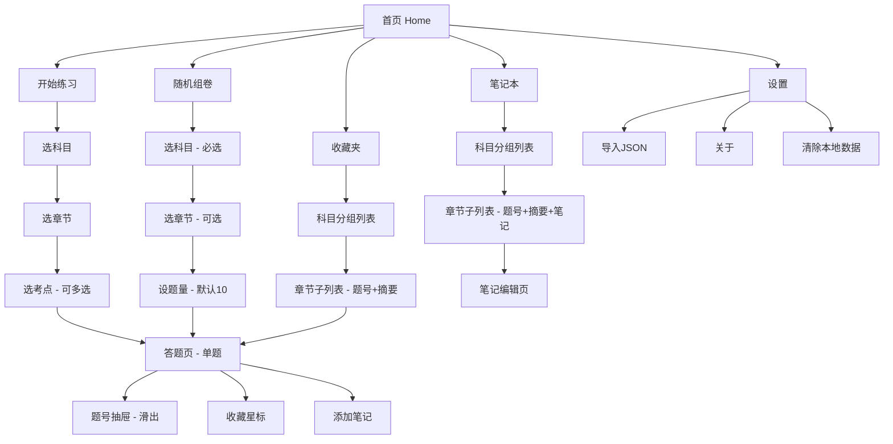
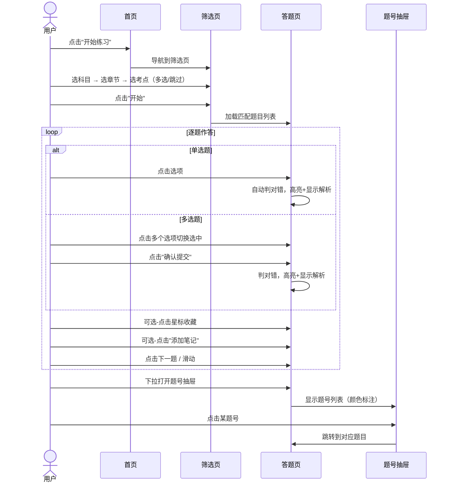

# 医考刷题 — 产品需求文档（PRD）

> 版本：v1.0 | 日期：2025-07-12 | 作者：许清楚（Xu）

---

## 1. 产品目标

**核心价值**：为西医综合（306）考研学生提供一款零门槛、纯本地、专注刷题效率的移动端工具。

**可量化目标**：

| # | 目标 | 衡量指标 |
|---|------|----------|
| G1 | 启动即用，零配置 | 首次启动 ≤ 3 秒进入刷题界面 |
| G2 | 题目查询毫秒响应 | 筛选+加载 ≤ 200ms（1万题量级） |
| G3 | 离线可用，数据永不丢失 | 100% 本地存储，0 网络依赖 |

---

## 2. 用户画像

| 属性 | 描述 |
|------|------|
| 身份 | 大三/大四医学生，备战西医综合306考研 |
| 年龄 | 21-25 岁 |
| 设备 | 以手机为主（iPhone / Android），部分使用平板 |
| 痛点 | ① 现有刷题App强制注册/登录；② 题库更新需联网付费；③ 广告干扰大；④ 解析质量参差 |
| 期望 | 打开即刷、按考点精准筛选、收藏+笔记一体化、数据随身走 |
| 使用场景 | 通勤碎片时间刷10题；晚间专注做章节练习；考前集中过收藏题 |

---

## 3. 用户故事

| ID | 用户故事 | 优先级 |
|----|----------|--------|
| US1 | 作为考研学生，我想按"科目→章节→考点"三级筛选题目，以便精准攻克薄弱环节 | P0 |
| US2 | 作为考研学生，我想在答题后立即看到正确答案和解析，以便即时纠正理解偏差 | P0 |
| US3 | 作为考研学生，我想收藏做错或重要的题目，以便后续快速回顾 | P0 |
| US4 | 作为考研学生，我想对题目添加个人笔记，以便记录自己的理解或易错点 | P1 |
| US5 | 作为考研学生，我想随机组卷模拟考试，以便检验整体掌握程度 | P1 |
| US6 | 作为考研学生，我想通过题号抽屉快速跳转已答题目，以便回顾和检查 | P0 |
| US7 | 作为考研学生，我想导入新JSON题库，以便获取更新的题目而无需重新安装 | P1 |
| US8 | 作为考研学生，我想在平板横屏时题号目录固定右侧，以便同时查看题号和答题区 | P2 |

---

## 4. 需求池

### P0 — 必做（MVP）

| 需求ID | 需求名称 | 描述 | 验收标准 |
|--------|----------|------|----------|
| P0-01 | 预置题库导入 | 首次启动自动将打包JSON导入SQLite | 首次启动后数据库有记录，二次启动不重复导入 |
| P0-02 | 三级筛选练习 | 科目→章节→考点（多选），加载匹配题目 | 空结果时提示"无匹配题目" |
| P0-03 | 单选题交互 | 点击选项直接选中，判对错+高亮+显示解析 | 选中后 ≤ 100ms 显示结果 |
| P0-04 | 多选题交互 | 点击切换选中→底部"确认提交"→判对错+高亮+解析 | 未选满提交时正常判分 |
| P0-05 | 题号抽屉 | 从下滑出，颜色标注：灰=未答/绿=正确/红=错误/黄=收藏 | 点击题号跳转对应题目 |
| P0-06 | 收藏功能 | 题目右上角星标切换 | 收藏状态持久化，收藏夹可查看 |
| P0-07 | 收藏夹列表 | 按科目→章节分组，显示题号+题干摘要 | 点击跳转答题页，可取消收藏 |

### P1 — 重要

| 需求ID | 需求名称 | 描述 | 验收标准 |
|--------|----------|------|----------|
| P1-01 | 随机组卷 | 选科目（必选）+章节（可选）+题量，从匹配题中随机抽取 | 题量不足时弹窗提示并取最大值 |
| P1-02 | 笔记-添加 | 题目详情页底部"添加笔记"，纯文本输入 | 保存后可从笔记本查看 |
| P1-03 | 笔记-管理 | 首页"笔记本"入口，按科目→章节分组，显示题号+摘要+笔记 | 支持编辑/删除 |
| P1-04 | 导入JSON题库 | 设置页提供"导入JSON"，支持合并或替换模式 | 导入后题目可正常查询答题 |
| P1-05 | 清除本地数据 | 设置页提供清除全部本地数据（题库+收藏+笔记） | 二次确认后清除，重启回到空库状态 |

### P2 — 可选

| 需求ID | 需求名称 | 描述 | 验收标准 |
|--------|----------|------|----------|
| P2-01 | 平板横屏适配 | 题号目录固定右侧 | 横屏时布局不重叠 |
| P2-02 | 答题统计 | 按科目/章节统计正确率 | 数据准确，图表可读 |
| P2-03 | 暗色模式 | 跟随系统暗色模式 | 无色彩断层 |

---

## 5. 信息架构



---

## 6. 核心数据模型

### Question（题目）

| 字段 | 类型 | 约束 | 说明 |
|------|------|------|------|
| id | INTEGER | PK | 题目唯一ID |
| type | TEXT | NOT NULL | 题型：`single` / `multi` |
| subject | TEXT | NOT NULL | 科目（如"生理学"） |
| chapter | TEXT | NOT NULL | 章节（如"细胞的基本功能"） |
| topic | TEXT | | 考点（如"钠泵"），可空 |
| stem | TEXT | NOT NULL | 题干 |
| options | TEXT | NOT NULL | JSON字符串，选项数组 |
| answer | TEXT | NOT NULL | 正确答案（单选="D"，多选="ABD"） |
| analysis | TEXT | | 解析，可空 |

### Bookmark（收藏）

| 字段 | 类型 | 约束 | 说明 |
|------|------|------|------|
| id | INTEGER | PK, AUTO | 自增主键 |
| question_id | INTEGER | FK → Question.id, UNIQUE | 关联题目ID，唯一约束防重复 |
| created_at | TEXT | NOT NULL | ISO 8601 时间戳 |

### Note（笔记）

| 字段 | 类型 | 约束 | 说明 |
|------|------|------|------|
| id | INTEGER | PK, AUTO | 自增主键 |
| question_id | INTEGER | FK → Question.id | 关联题目ID |
| content | TEXT | NOT NULL | 笔记纯文本内容 |
| updated_at | TEXT | NOT NULL | ISO 8601 最后修改时间 |

### QuizSession（答题会话）

| 字段 | 类型 | 约束 | 说明 |
|------|------|------|------|
| id | INTEGER | PK, AUTO | 自增主键 |
| type | TEXT | NOT NULL | 会话类型：`practice` / `random` |
| question_ids | TEXT | NOT NULL | JSON数组，会话包含的题目ID有序列表 |
| current_index | INTEGER | NOT NULL DEFAULT 0 | 当前答题位置 |
| answers | TEXT | NOT NULL DEFAULT '{}' | JSON对象，key=题目ID, value=用户答案 |
| created_at | TEXT | NOT NULL | ISO 8601 创建时间 |

> **说明**：QuizSession 用于练习模式和随机组卷的答题进度持久化。退出时可选保存进度，重新进入可恢复。随机组卷退出后不保存记录（P1-01），但会话内仍需此模型管理状态。

---

## 7. 关键交互流程

### 7.1 练习模式答题流程



### 7.2 收藏流程

```mermaid
sequenceDialog
    actor U as 用户
    participant Q as 答题页
    participant DB as 本地数据库
    participant B as 收藏夹

    U->>Q: 点击星标（未收藏→收藏）
    Q->>DB: INSERT Bookmark
    DB-->>Q: 成功
    Q->>Q: 星标变黄（实心）

    U->>Q: 再次点击星标（取消收藏）
    Q->>DB: DELETE Bookmark
    DB-->>Q: 成功
    Q->>Q: 星标变灰（空心）

    U->>B: 从首页进入收藏夹
    B->>DB: SELECT Bookmark JOIN Question
    DB-->>B: 按科目→章节分组返回
    B->>B: 渲染列表
    U->>B: 点击某题
    B->>Q: 跳转答题页（单题模式）
```

---

## 8. 待确认事项

| # | 问题 | 影响范围 | 建议 |
|---|------|----------|------|
| 1 | 多选题答案格式：`"ABD"` 还是 `["A","B","D"]`？ | 数据模型 + 判分逻辑 | 建议用字符串 `"ABD"`，简洁且JSON兼容 |
| 2 | 导入JSON时"合并"策略：同ID题目是覆盖还是跳过？ | 导入功能 | 建议同ID覆盖（upsert），并导入后显示统计 |
| 3 | 答题进度是否支持跨会话保存？（退出后再进入是否恢复上次位置） | QuizSession 生命周期 | P0 可不保存，P2 可加进度恢复 |
| 4 | 题库数据量预估？影响SQLite索引策略 | 性能 | 建议按1万题设计索引，预留10万题扩展 |
| 5 | 是否需要题目搜索功能？ | 首页功能 | P2 可考虑全文搜索 |
| 6 | 笔记是否支持 Markdown 或仅纯文本？ | 笔记编辑器 | 明确为纯文本，降低复杂度 |
| 7 | App 中文名称确认 | 品牌展示 | "医考刷题"为暂定名，需确认 |
