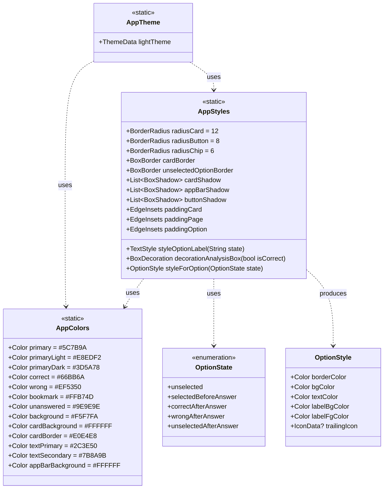
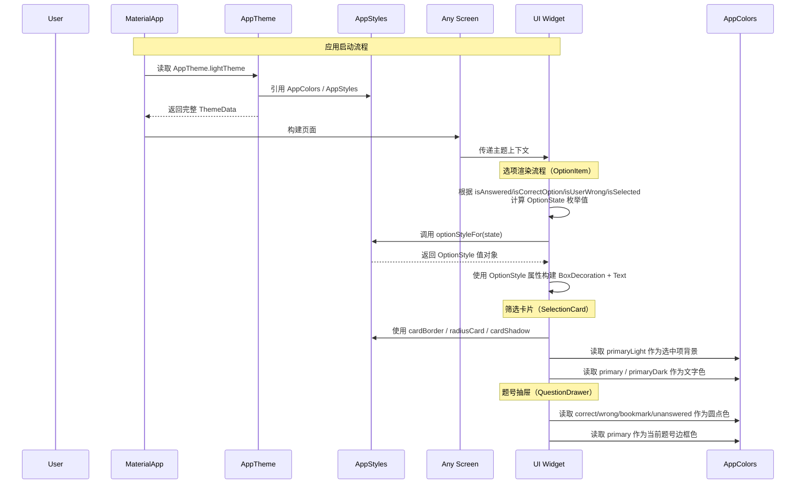
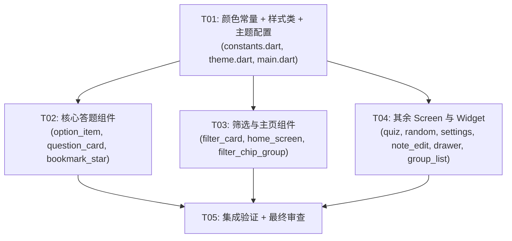

# 全 App 视觉风格重构 — 系统设计与任务分解

> 项目：medical_workbuddy（西医综合306考研刷题 Flutter App）
> 当前主色：#2196F3（Material Blue）→ 目标主色：#5C7B9A（蓝灰低饱和）

---

## Part A: System Design

### 1. Implementation Approach

#### 核心难点分析

| 难点 | 说明 | 解决方案 |
|------|------|----------|
| **颜色体系全局替换** | 当前颜色分散在 AppColors 常量、theme.dart、以及多个 widget/screen 的内联硬编码 | 统一在 `AppColors` 更新，widget 中硬编码色值替换为 AppColors 引用 |
| **ThemeData 与内联样式并存** | AppBar/Card/Button 等由 ThemeData 控制，但 OptionItem、分析框、FilterCard 等大量使用内联 BoxDecoration | ThemeData 覆盖通用组件，内联样式通过 `AppStyles` 静态类统一管理 |
| **选项状态颜色复杂** | OptionItem 有 5 种视觉状态（正确/错误/选中/未选/用户误选），每状态有 border/bg/text/icon 四种子属性 | 抽取为 `_optionStyleFor(state)` 计算函数或 OptionStyle 值对象 |
| **渐变横幅** | 首页使用了 `LinearGradient` 从主色到透明，需要保持但更换色值 | 主色变换后自动继承 |

#### 架构方案：ThemeData + AppStyles 混合模式

**推荐理由**：Flutter 的 `ThemeData` 擅长控制 Material 组件（AppBar, Card, Button, Chip, InputDecoration, BottomSheet）的全局默认样式；但 OptionItem、分析框、筛选条等自定义容器使用 BoxDecoration 内联样式，无法被 ThemeData 直接覆盖。因此采用 **ThemeData 管系统组件 + AppStyles 管自定义组件** 的混合策略。

```
ThemeData (theme.dart)
  ├── colorScheme: 主色系统
  ├── appBarTheme: AppBar 白色背景 + 细阴影
  ├── cardTheme: Card 圆角+边框+弱阴影
  ├── elevatedButtonTheme: 按钮样式
  ├── outlinedButtonTheme: 边框按钮样式
  ├── chipTheme: Chip/ChoiceChip 样式
  ├── inputDecorationTheme: TextField 样式
  └── bottomSheetTheme: BottomSheet 圆角

AppStyles (constants.dart)
  ├── 圆角常量 (radiusCard, radiusButton, radiusChip)
  ├── 边框常量 (cardBorder, unselectedBorder, selectedBorder)
  ├── 阴影常量 (cardShadow, appBarShadow, buttonShadow)
  ├── 文本样式 (optionText, labelText, analysisText)
  └── 选项配色函数 (styleForOption(state))
```

#### 选用的框架/库

| 技术 | 版本 | 用途 |
|------|------|------|
| Flutter Material | SDK 内置 | 主题系统、Material 组件 |
| flutter_riverpod | ^2.5.0 | 状态管理（不变更） |
| go_router | ^14.0.0 | 路由（不变更） |

所有 UI 改动零包依赖变更。

---

### 2. File List

```
lib/
├── core/
│   ├── constants.dart        [MODIFY] — 更新 AppColors + 新增 AppStyles
│   └── theme.dart            [MODIFY] — 重写 AppTheme 主题配置
├── main.dart                 [MODIFY] — 更新 loading 屏主题色
├── app.dart                  (无改动)
├── screens/
│   ├── home_screen.dart       [MODIFY] — 渐变横幅色值、EntryCard 阴影/边框
│   ├── filter_screen.dart     [MODIFY] — 开始按钮继承主题（微小改动）
│   ├── quiz_screen.dart       [MODIFY] — 底部栏阴影/背景色
│   ├── random_setup_screen.dart  [MODIFY] — ChoiceChip、Dropdown 样式
│   ├── settings_screen.dart   [MODIFY] — Card/ListTile 样式、硬编码色值替换
│   ├── bookmark_list_screen.dart  (无实质视觉改动)
│   ├── note_list_screen.dart      (无实质视觉改动)
│   └── note_edit_screen.dart  [MODIFY] — 题干容器样式、TextField 边框
└── widgets/
    ├── question_card.dart     [MODIFY] — 题型标签色值、分析框色值
    ├── option_item.dart       [MODIFY] — 全部状态颜色使用新 palette
    ├── filter_card.dart       [MODIFY] — 背景色、边框、选中色
    ├── filter_chip_group.dart [MODIFY] — 选中色更新（或标记 deprecated）
    ├── bookmark_star.dart     [MODIFY] — 图标色值自动继承 AppColors
    ├── question_drawer.dart   [MODIFY] — 统计圆点色值、题号按钮色值
    └── group_list_view.dart   [MODIFY] — 空状态图标色、ExpansionTile 样式
```

**总共 15 个文件需要修改**，5 个文件无实质视觉变动（保留不改动）。

---

### 3. Data Structures and Interfaces



#### 核心类型详解

```dart
// lib/core/constants.dart

class AppColors {
  AppColors._();

  // === 主色调 ===
  static const Color primary = Color(0xFF5C7B9A);       // 蓝灰主色
  static const Color primaryLight = Color(0xFFE8EDF2);  // 淡蓝灰背景
  static const Color primaryDark = Color(0xFF3D5A78);   // 深蓝灰文字/强调

  // === 语义色（低饱和） ===
  static const Color correct = Color(0xFF66BB6A);       // 正确 - 低饱和绿
  static const Color wrong = Color(0xFFEF5350);         // 错误 - 低饱和红
  static const Color bookmark = Color(0xFFFFB74D);      // 收藏 - 低饱和黄
  static const Color unanswered = Color(0xFF9E9E9E);    // 未答 - 中性灰

  // === 背景与卡片 ===
  static const Color background = Color(0xFFF5F7FA);    // 极浅灰蓝全局背景
  static const Color cardBackground = Color(0xFFFFFFFF); // 卡片白色背景
  static const Color cardBorder = Color(0xFFE0E4E8);    // 卡片极浅灰边框

  // === 文字 ===
  static const Color textPrimary = Color(0xFF2C3E50);   // 深蓝灰 - 主要文字
  static const Color textSecondary = Color(0xFF7B8A9B); // 中灰 - 次要文字

  // === AppBar ===
  static const Color appBarBackground = Color(0xFFFFFFFF);
  static const Color appBarForeground = Color(0xFF2C3E50);
}

class AppStyles {
  AppStyles._();

  // ===== 圆角体系 =====
  static const BorderRadius radiusCard = BorderRadius.all(Radius.circular(12));
  static const BorderRadius radiusButton = BorderRadius.all(Radius.circular(8));
  static const BorderRadius radiusChip = BorderRadius.all(Radius.circular(6));
  static const BorderRadius radiusOption = BorderRadius.all(Radius.circular(10));

  // ===== 边框体系 =====
  static final BoxBorder cardBorder = Border.all(
    color: AppColors.cardBorder,
    width: 1.0,
  );
  static final BoxBorder unselectedOptionBorder = Border.all(
    color: const Color(0xFFD5D9E0),
    width: 1.0,
  );

  // ===== 阴影体系 =====
  static const List<BoxShadow> cardShadow = [
    BoxShadow(
      color: Color(0x0A000000),
      blurRadius: 3,
      offset: Offset(0, 1),
    ),
  ];
  static const List<BoxShadow> appBarShadow = [
    BoxShadow(
      color: Color(0x0F000000),
      blurRadius: 1,
      offset: Offset(0, 0.5),
    ),
  ];
  static const List<BoxShadow> buttonShadow = [
    BoxShadow(
      color: Color(0x0F000000),
      blurRadius: 2,
      offset: Offset(0, 1),
    ),
  ];

  // ===== 间距体系 =====
  static const EdgeInsets paddingPage = EdgeInsets.all(16);
  static const EdgeInsets paddingCard = EdgeInsets.all(16);
  static const EdgeInsets paddingOption = EdgeInsets.symmetric(horizontal: 12, vertical: 10);

  // ===== 文本样式 =====
  static const TextStyle textPageTitle = TextStyle(
    fontSize: 17,
    fontWeight: FontWeight.w500,
    color: AppColors.textPrimary,
    height: 1.5,
  );
  static const TextStyle textSectionTitle = TextStyle(
    fontWeight: FontWeight.w600,
    fontSize: 15,
    color: AppColors.textPrimary,
  );
  static const TextStyle textBodySecondary = TextStyle(
    fontSize: 12,
    color: AppColors.textSecondary,
  );
}

// 选项状态枚举
enum OptionState {
  unselected,
  selectedBeforeAnswer,
  correctAfterAnswer,
  wrongAfterAnswer,
  unselectedAfterAnswer,
}

// 选项样式值对象
class OptionStyle {
  final Color borderColor;
  final Color bgColor;
  final Color textColor;
  final Color labelBgColor;
  final Color labelFgColor;
  final IconData? trailingIcon;
  final double borderWidth;

  const OptionStyle({
    required this.borderColor,
    required this.bgColor,
    required this.textColor,
    required this.labelBgColor,
    required this.labelFgColor,
    this.trailingIcon,
    this.borderWidth = 1.0,
  });
}

// 选项样式工厂
OptionStyle optionStyleFor(OptionState state) {
  switch (state) {
    case OptionState.unselected:
      return OptionStyle(
        borderColor: const Color(0xFFD5D9E0),
        bgColor: AppColors.cardBackground,
        textColor: AppColors.textPrimary,
        labelBgColor: const Color(0xFFE8ECF0),
        labelFgColor: AppColors.textSecondary,
      );
    case OptionState.selectedBeforeAnswer:
      return OptionStyle(
        borderColor: AppColors.primary,
        bgColor: AppColors.primaryLight.withValues(alpha: 0.3),
        textColor: AppColors.primaryDark,
        labelBgColor: AppColors.primary,
        labelFgColor: Colors.white,
        borderWidth: 2.0,
      );
    case OptionState.correctAfterAnswer:
      return OptionStyle(
        borderColor: AppColors.correct,
        bgColor: AppColors.correct.withValues(alpha: 0.08),
        textColor: const Color(0xFF2E7D32),
        labelBgColor: AppColors.correct,
        labelFgColor: Colors.white,
        trailingIcon: Icons.check_circle,
        borderWidth: 2.0,
      );
    case OptionState.wrongAfterAnswer:
      return OptionStyle(
        borderColor: AppColors.wrong,
        bgColor: AppColors.wrong.withValues(alpha: 0.08),
        textColor: const Color(0xFFC62828),
        labelBgColor: AppColors.wrong,
        labelFgColor: Colors.white,
        trailingIcon: Icons.cancel,
        borderWidth: 2.0,
      );
    case OptionState.unselectedAfterAnswer:
      return OptionStyle(
        borderColor: const Color(0xFFE0E4E8),
        bgColor: AppColors.cardBackground,
        textColor: AppColors.textSecondary,
        labelBgColor: const Color(0xFFE8ECF0),
        labelFgColor: AppColors.textSecondary,
      );
  }
}
```

---

### 4. Program Call Flow



---

### 5. Anything UNCLEAR

1. **渐变横幅设计方案**：首页 `LinearGradient` 当前从 `AppColors.primary` 到 `withValues(alpha:0.8)`。改为蓝灰主色后建议使用 `primary` → `primaryLight` 的渐变，需要确认是否保持白色文字。
2. **`filter_chip_group.dart` 与 `filter_card.dart` 的关系**：`FilterChipGroup` 使用的是 Material `FilterChip` 组件（受 ThemeData 影响），而 `SelectionCard`（在 filter_card.dart 中）是自定义容器实现。两者在 filter_screen 中的使用似乎 `SelectionCard` 已取代 FilterChipGroup——但 FilterChipGroup 仍被其他文件引用吗？经检查无其他引用，可标记为 deprecated。
3. **SettingsScreen 的 ListTile 样式**：`ListTile` 的 leading icon 使用了 `Color(0xFF2196F3)` 和 `Color(0xFFF44336)` 硬编码，需要替换为 AppColors.primary 和 AppColors.wrong。
4. **NoteEditScreen 的题干容器**：使用了 `Colors.grey.shade100` 背景和 `Colors.grey.shade600` 文字，替换为 `AppColors.primaryLight` 和 `AppColors.textSecondary`。
5. **GroupListView 空状态**：使用了 `Icons.inbox_outlined` 配合 `Colors.grey.shade400`，替换为 `AppColors.textSecondary`。

所有假定已在上述分析中明确记录，无需额外确认即可开工。

---

## Part B: Task Decomposition

### 6. Required Packages

```
无新增包依赖。
现有依赖（不变更）：
- flutter (SDK)
- flutter_riverpod ^2.5.0
- go_router ^14.0.0
- sqflite ^2.3.0
- path ^1.9.0
- shared_preferences ^2.2.0
- file_picker ^8.0.0
- intl ^0.19.0
```

---

### 7. Task List (ordered by dependency)

#### T01: 项目基础设施 — 颜色常量 + 样式常量 + 主题配置

| 字段 | 值 |
|------|-----|
| **Task ID** | T01 |
| **Task Name** | 更新 AppColors 颜色体系 + 新增 AppStyles 样式类 + 重写 AppTheme 主题配置 |
| **Priority** | P0 |
| **Dependencies** | 无 |

**Source Files:**

| 文件 | 操作 |
|------|------|
| `lib/core/constants.dart` | 更新 `AppColors` 全部色值；新增 `AppStyles` 静态类（圆角/边框/阴影/间距/文本样式/选项中状态样式工厂）；新增 `OptionState` 枚举 + `OptionStyle` 类 |
| `lib/core/theme.dart` | 完全重写 `AppTheme.lightTheme`：AppBar 白色背景+细阴影+深色前景色；Card 白色背景+1px边框+弱阴影；ElevatedButton 蓝灰主色+8px圆角；OutlinedButton 边框样式；ChipTheme 圆角6px；InputDecorationTheme 蓝灰边框；BottomSheetTheme 顶部圆角12px；ScaffoldBackgroundColor #F5F7FA |
| `lib/main.dart` | 更新 loading 屏的 `ThemeData(colorSchemeSeed: ...)` 为新主色 `Color(0xFF5C7B9A)` |

**修改内容详述：**

1. **constants.dart 改动集：**
   - `AppColors.primary`: `0xFF2196F3` → `0xFF5C7B9A`
   - `AppColors.correct`: `0xFF4CAF50` → `0xFF66BB6A`
   - `AppColors.wrong`: `0xFFF44336` → `0xFFEF5350`
   - `AppColors.bookmark`: `0xFFFFC107` → `0xFFFFB74D`
   - 新增 8 个颜色常量：`primaryLight`, `primaryDark`, `background`, `cardBackground`, `cardBorder`, `textPrimary`, `textSecondary`, `appBarBackground`
   - 新增 `AppStyles` 完整静态类（约 120 行）

2. **theme.dart 改动集：**
   - `colorSchemeSeed`: `AppColors.primary` → `AppColors.primary`（引用不变，色值已变）
   - `appBarTheme`: `backgroundColor: primary, foregroundColor: white` → `backgroundColor: white, foregroundColor: textPrimary, elevation: 0, scrolledUnderElevation: 0.5`
   - `cardTheme`: 保留 `elevation: 2` → 改为 `elevation: 0` + `shape: RoundedRectangleBorder(side: BorderSide(color: cardBorder), borderRadius: radiusCard)` + `shadowColor: Colors.transparent`
   - `elevatedButtonTheme`: 保留主色，确认圆角 8px
   - 新增 `outlinedButtonTheme`: `side: BorderSide(color: primary)`, `shape: RoundedRectangleBorder(radiusButton)`
   - 新增 `inputDecorationTheme`: `border: OutlineInputBorder(borderSide: BorderSide(color: cardBorder))`, `contentPadding`
   - 新增 `bottomSheetTheme`: `shape: RoundedRectangleBorder(borderRadius: vertical(top: 12))`
   - 新增 `scaffoldBackgroundColor: AppColors.background`
   - 新增 `dividerTheme`, `expansionTileTheme`

3. **main.dart 改动集：**
   - loading 屏的 `ThemeData(colorSchemeSeed: Color(0xFF2196F3))` → `ThemeData(colorSchemeSeed: AppColors.primary)`

---

#### T02: 核心答题组件 — OptionItem + QuestionCard + BookmarkStar

| 字段 | 值 |
|------|-----|
| **Task ID** | T02 |
| **Task Name** | 重构 OptionItem 状态驱动颜色体系 + QuestionCard 题型标签与分析框色值更新 + BookmarkStar 色值 |
| **Priority** | P0 |
| **Dependencies** | T01 |

**Source Files:**

| 文件 | 操作 |
|------|------|
| `lib/widgets/option_item.dart` | 完全重构：弃用行内条件色值逻辑，改为 OptionState 枚举 + `optionStyleFor()` 工厂函数驱动。保留所有视觉行为不变。 |
| `lib/widgets/question_card.dart` | 题型标签 container 色值从 `AppColors.primary.withValues(alpha:0.1)` 改为 `AppColors.primaryLight`；文字色改为 `AppColors.primaryDark`；分析框背景从 `Colors.blue.shade50` 改为 `Color(0xFFE8EDF2)`（primaryLight），边框 `Colors.blue.shade100` 改为 `AppColors.cardBorder`，文字色从 `Colors.blue.shade700/800` 改为 `AppColors.primaryDark` |
| `lib/widgets/bookmark_star.dart` | 无色值硬编码，仅确认使用 `AppColors.bookmark`（色值已自动更新） |

**OptionItem 重构要点：**

当前逻辑（约 25 行 if/else）需要映射为新枚举驱动：

```
旧逻辑链 → 新枚举值
─────────────────────────────────────────────
isAnswered && isCorrectOption       → OptionState.correctAfterAnswer
isAnswered && isUserWrong           → OptionState.wrongAfterAnswer
isAnswered && !isCorrect && !wrong  → OptionState.unselectedAfterAnswer
!isAnswered && isSelected           → OptionState.selectedBeforeAnswer
!isAnswered && !isSelected          → OptionState.unselected
```

提取为私有方法 `OptionState _resolveState()` 后，build 方法简化为：

```dart
final state = _resolveState();
final style = optionStyleFor(state);
// 直接用 style 属性构建 UI
```

---

#### T03: 筛选与主页组件 — SelectionCard + HomeScreen + FilterChipGroup

| 字段 | 值 |
|------|-----|
| **Task ID** | T03 |
| **Task Name** | 更新 SelectionCard 筛选卡片样式 + HomeScreen 渐变横幅与 EntryCard + FilterChipGroup 颜色 |
| **Priority** | P1 |
| **Dependencies** | T01 |

**Source Files:**

| 文件 | 操作 |
|------|------|
| `lib/widgets/filter_card.dart` | Container 背景 `Colors.grey.shade100` → `AppColors.primaryLight`；圆角确认使用 `AppStyles.radiusCard`；选项项背景 `Color(0xFFE3F2FD)` → `AppColors.primaryLight`；选项项文字色 `Color(0xFF1565C0)` → `AppColors.primaryDark`；选项项边框色从 `Colors.grey.shade300` → `AppColors.cardBorder`；选中项边框色从 `Color(0xFFE3F2FD)` → `AppColors.primary`；全选文字 `Colors.blue` → `AppColors.primary`；图标色 `Colors.black87` → `AppColors.primaryDark` |
| `lib/screens/home_screen.dart` | 渐变横幅：`LinearGradient(colors: [AppColors.primary, AppColors.primary.withValues(alpha:0.8)])` → `[AppColors.primary, AppColors.primaryLight]`；保留白色文字；`_EntryCard` 的 `Card(elevation:2)` → 使用 `AppStyles.cardShadow` + `AppStyles.cardBorder`（elevation:0），圆角保持12px；图标色（teal/orange/grey）不变更（功能入口卡片用不同颜色更好区分） |
| `lib/widgets/filter_chip_group.dart` | 更新 `selectedColor: AppColors.primary.withValues(alpha: 0.2)` → `AppColors.primaryLight`；`backgroundColor: Colors.grey.shade100` → `Colors.white`；`side` 边框色 `Colors.grey.shade300` → `AppColors.cardBorder`，选中时 `AppColors.primary`；标注为 `@Deprecated('Use SelectionCard instead')` |

---

#### T04: 其余 Screen 组件 — QuizScreen + RandomSetupScreen + SettingsScreen + NoteEditScreen + QuestionDrawer + GroupListView

| 字段 | 值 |
|------|-----|
| **Task ID** | T04 |
| **Task Name** | 更新余下 6 个 screens/widgets 的散落样式点 |
| **Priority** | P1 |
| **Dependencies** | T01 |

**Source Files:**

| 文件 | 操作 |
|------|------|
| `lib/screens/quiz_screen.dart` | 底部导航栏 Container：`color: Colors.white` → `AppColors.cardBackground`；`BoxShadow` 保持但色值改为 `Color(0x0A000000)`（用 AppStyles 常量引用） |
| `lib/screens/random_setup_screen.dart` | `ChoiceChip` 由 ThemeData 的 chipTheme 控制（已在 T01 中设置），无需额外改动；`DropdownButtonFormField` 的 `OutlineInputBorder` 由 ThemeData 的 inputDecorationTheme 控制（已在 T01 中设置）；`Slider` 由 ThemeData 的 colorScheme 控制；`ElevatedButton` 由 ThemeData 控制 |
| `lib/screens/settings_screen.dart` | Card ListTile：leading icon 色 `Color(0xFF2196F3)` → `AppColors.primary`；`Color(0xFFF44336)` → `AppColors.wrong`；卡片背景/边框继承 T01 的 CardTheme；清除按钮 `backgroundColor: Color(0xFFF44336)` → `AppColors.wrong`；关于区文字 `Colors.grey.shade600` → `AppColors.textSecondary` |
| `lib/screens/note_edit_screen.dart` | 题干 container 背景 `Colors.grey.shade100` → `AppColors.primaryLight`；圆角保留 8px（改为 `AppStyles.radiusButton`）；标题文字 `Colors.grey.shade600` → `AppColors.textSecondary`；TextField border 由 ThemeData 的 inputDecorationTheme 控制 |
| `lib/widgets/question_drawer.dart` | 统计圆点色值已使用 AppColors（自动更新）；题号按钮颜色使用 AppColors（自动更新）；当前题号边框色 `AppColors.primary`（自动更新）；拖拽条 `Colors.grey.shade300` → `AppColors.cardBorder`；BottomSheet 圆角由 ThemeData 控制 |
| `lib/widgets/group_list_view.dart` | 空状态图标色 `Colors.grey.shade400` → `AppColors.textSecondary`；文字色 `Colors.grey.shade500` → `AppColors.textSecondary`；ExpansionTile 文字色 `Colors.grey.shade700` → `AppColors.textSecondary`；ListTile 副标题 `Colors.grey.shade500` → `AppColors.textSecondary` |

---

#### T05: 集成调试 + 收尾清理

| 字段 | 值 |
|------|-----|
| **Task ID** | T05 |
| **Task Name** | 集成验证 + 视觉一致性审查 + 废弃代码清理 |
| **Priority** | P2 |
| **Dependencies** | T02, T03, T04 |

**Source Files:**

| 文件 | 操作 |
|------|------|
| `lib/widgets/filter_chip_group.dart` | 确认废弃标记，保留源码以便回退 |
| (全部修改文件) | 全局审查：确保无残留的 `Colors.blue`, `Color(0xFF2196F3)`, `Colors.grey.shade100/300/400/500/600/700` 等旧色值 |

**检查清单：**
- [ ] 所有 `Color(0xFF2196F3)` 已替换
- [ ] 所有 `Colors.blue.shade*` 已替换
- [ ] 所有 `Colors.grey.shade*` 中的背景色（100, 200）已替换为 `AppColors.primaryLight` 或 `AppColors.cardBackground`
- [ ] 所有 `Colors.grey.shade*` 中的文字色（500, 600, 700）已替换为 `AppColors.textSecondary`
- [ ] loading 屏不再闪现蓝色主色调
- [ ] AppBar 全部为白色背景 + 深色文字
- [ ] 卡片均有 1px 细边框
- [ ] 所有对话框圆角一致
- [ ] 首页渐变横幅显示正常

---

### 8. Shared Knowledge

#### 视觉一致性规则

```
- 全局背景色：Color(0xFFF5F7FA) — 通过 scaffoldBackgroundColor 设置
- 卡片背景色：Color(0xFFFFFFFF) — 白色
- 卡片边框：1px solid Color(0xFFE0E4E8)
- 卡片阴影：0 1px 3px rgba(0,0,0,0.04)
- 大卡片圆角：12px (BorderRadius.circular(12))
- 小卡片/按钮圆角：8px (BorderRadius.circular(8))
- Chip 圆角：6px (BorderRadius.circular(6))
- AppBar：白底 + 深色前景 + 底部细阴影
- 文字主色：#2C3E50（深蓝灰）
- 文字次要：#7B8A9B（中灰）
```

#### OptionItem 状态配色矩阵

| 状态 | 边框 | 背景 | 文字 | 标签背景 | 标签文字 | 尾部图标 |
|------|------|------|------|----------|----------|----------|
| 未选中 | #D5D9E0 1px | #FFFFFF | #2C3E50 | #E8ECF0 | #7B8A9B | 无 |
| 答题前选中 | #5C7B9A 2px | primaryLight 30% | #3D5A78 | #5C7B9A | #FFFFFF | 无 |
| 正确选项 | #66BB6A 2px | #66BB6A 8% | #2E7D32 | #66BB6A | #FFFFFF | check_circle |
| 用户误选 | #EF5350 2px | #EF5350 8% | #C62828 | #EF5350 | #FFFFFF | cancel |
| 未选/已答 | #E0E4E8 1px | #FFFFFF | #7B8A9B | #E8ECF0 | #7B8A9B | 无 |

#### 代码引用风格

```dart
// ✅ 推荐：通过 AppStyles / AppColors 统一引用
decoration: BoxDecoration(
  border: AppStyles.cardBorder,
  borderRadius: AppStyles.radiusCard,
  boxShadow: AppStyles.cardShadow,
)

// ❌ 禁止：内联写死色值/圆角
decoration: BoxDecoration(
  border: Border.all(color: Color(0xFFE0E4E8)),
  borderRadius: BorderRadius.circular(12),
  boxShadow: [BoxShadow(...)],
)
```

---

### 9. Task Dependency Graph



---

## 附录：文件影响矩阵（完整版）

| 文件 | 修改类型 | 具体修改点 | 影响程度 |
|------|----------|-----------|----------|
| `lib/core/constants.dart` | **重写** | AppColors 全色值；新增 AppStyles(~120行)；新增 OptionState/OptionStyle | 🔴 大 |
| `lib/core/theme.dart` | **重写** | 全部主题字段重建 | 🔴 大 |
| `lib/main.dart` | 微调 | 1 行色值 | 🟢 小 |
| `lib/screens/home_screen.dart` | 中等 | 渐变色值修改；EntryCard(改用 AppStyles) | 🟡 中 |
| `lib/screens/filter_screen.dart` | 微调 | 按钮继承主题（可能无改动） | 🟢 小 |
| `lib/screens/quiz_screen.dart` | 微调 | 底部栏阴影常量替换 | 🟢 小 |
| `lib/screens/random_setup_screen.dart` | 微调 | 由 ThemeData 接管 | 🟢 小 |
| `lib/screens/settings_screen.dart` | 中等 | 3处硬编码色值替换 + 卡片继承主题 | 🟡 中 |
| `lib/screens/note_edit_screen.dart` | 微调 | container 背景色 + 文字色替换 | 🟢 小 |
| `lib/widgets/option_item.dart` | **重构** | 条件逻辑→OptionState枚举驱动 | 🔴 大 |
| `lib/widgets/question_card.dart` | 中等 | 题型标签 + 分析框色值替换 | 🟡 中 |
| `lib/widgets/filter_card.dart` | 中等 | 背景/边框/选中态色值替换 | 🟡 中 |
| `lib/widgets/filter_chip_group.dart` | 微调 | 选中色值 + 废弃标记 | 🟢 小 |
| `lib/widgets/bookmark_star.dart` | 无 | 自动继承 AppColors 新色值 | 🟢 无 |
| `lib/widgets/question_drawer.dart` | 微调 | 拖拽条色值替换 | 🟢 小 |
| `lib/widgets/group_list_view.dart` | 微调 | 空状态图标/文字色值替换 | 🟢 小 |

**总计**：15 个文件修改，其中 3 个大改（constants/theme/option_item），4 个中等改动，8 个小改动。

---

*文档版本：v1.0*
*设计者：Bob (Architect)*
